# Kitchen Editor Codebase Documentation

This document describes the current uploaded `src` codebase. No application code has been changed. This revision updates the **File structure and purpose** section so it is shown as a **diagram view** instead of a normal listing.

## Snapshot

- Root package inspected: `src/`
- Total source files: 285
- TypeScript files: 162
- TSX component files: 77
- JSON catalog definition files: 45
- CSS files: 1
- Runtime state model: Zustand store in `src/engine/scene/designSceneStore.ts`
- Rendering stack: React, React Three Fiber, Drei, and Three.js
- UI stack: React components with Tailwind utility classes and Lucide icons
- Architecture style: the codebase is **function-oriented**, not classical class-based OOP. There are no major ES/TypeScript classes. Instead, the project is organized using:
  - domain modules
  - React function components
  - factory functions
  - action creators
  - pure geometry utilities
  - store actions and selectors

---

## File structure and purpose — Diagram view

### 1) High-level architecture diagram

```mermaid
flowchart TD
    SRC[src/] --> APP[app/\nNext.js app shell]
    SRC --> CORE[core/\nshared primitives and utilities]
    SRC --> ENGINE[engine/\nruntime scene/domain logic]
    SRC --> FEATURES[features/\nUI, editor workflows, rendering]
    SRC --> TYPES[types/\nshared type declarations]

    APP --> APP1[globals.css\nglobal styles]
    APP --> APP2[layout.tsx\nroot layout + metadata]
    APP --> APP3[page.tsx\nentry page rendering KitchenEditorApp]

    CORE --> GEO[geometry/\npoints, sizes, bounds, rotations, polygons]
    CORE --> IDS[ids/\nID factory helpers]

    ENGINE --> ASM[assemblies/\nassembly definitions, config, tree building]
    ENGINE --> CT[countertops/\nderived countertop opening logic]
    ENGINE --> DZ[design-zones/\nreservation zone domain]
    ENGINE --> PG[primitive-geometry/\nlow-level geometry builders]
    ENGINE --> SCENE[scene/\nsource-of-truth store and actions]
    ENGINE --> SE[scene-entities/\nselection, transforms, guides]
    ENGINE --> WALLS[walls/\nwall graph, geometry, elevation, openings]

    FEATURES --> KE[ kitchen-editor/\nmain feature area ]
    KE --> WORKSPACE[workspace/\napp shell and layout panels]
    KE --> AIPANEL[ai-panel/\nlocal AI chat shell]
    KE --> CATALOG[catalog-panel/\ncatalog browsing UI]
    KE --> CATALOGDATA[catalogs/\nraw catalog JSON + registry]
    KE --> EDITORS[editors/\nviewport and view-mode controls]
    KE --> INTERACTION[interaction/\nplacement, dragging, wall drawing]
    KE --> PROPS[properties-panel/\nselected-object editors]
    KE --> RENDER[rendering/\nThree.js scene layers]
    KE --> TOOLBAR[editor-toolbar/\ntools, history, commands]
    KE --> EPANEL[editor-panel/\nright sidebar shell]
    KE --> SELECTION[selection/\nselection helpers]
    KE --> VIEWPOLICY[view-policies/\nview visibility rules]
    KE --> FORMAT[formatting/\nlabels and display strings]

    TYPES --> JMOD[jsonModules.d.ts\nJSON module typing]
```



### 2) Detailed tree diagram

```text
src/
├── app/                                # Next.js entry layer
│   ├── globals.css                     # Global CSS and Tailwind directives
│   ├── layout.tsx                      # Root app layout and metadata
│   └── page.tsx                        # Entry page that mounts KitchenEditorApp
│
├── core/                               # Shared low-level helpers
│   ├── geometry/                       # Fundamental geometric math and shared value types
│   │   ├── boxBounds.ts                # 3D bounds math
│   │   ├── planPointGeometry.ts        # plan-view distance and angle helpers
│   │   ├── pointTypes.ts               # 2D/3D point types and transforms
│   │   ├── polygonGeometry.ts          # polygon containment helpers
│   │   ├── rotationTypes.ts            # angle/rotation helpers
│   │   └── sizeTypes.ts                # shared size types
│   └── ids/
│       └── createId.ts                 # runtime ID factory
│
├── engine/                             # Core editor runtime/domain logic
│   ├── assemblies/                     # Assembly definitions, configs, tree building, bounds
│   │   ├── front-outline/              # elevation/front-outline generation
│   │   ├── raw-definition/             # raw JSON definition parsing/evaluation
│   │   ├── assemblyBounds.ts           # visual bounds measurement
│   │   ├── assemblyComponentTypes.ts   # primitive/nested component types
│   │   ├── assemblyConfiguration.ts    # option/configuration types
│   │   ├── assemblyConfigurationFactory.ts # default config + placed assembly factory
│   │   ├── assemblyCutoutBehaviorTypes.ts # wall/countertop cutout behavior types
│   │   ├── assemblyDefinitionTypes.ts  # assembly definition schema
│   │   ├── assemblyRegistry.ts         # definition registry access
│   │   ├── assemblyTreeBuilder.ts      # evaluated assembly tree builder
│   │   └── placedAssemblyTypes.ts      # placed assembly runtime model
│   │
│   ├── countertops/                    # Derived countertop opening and clipping logic
│   │   ├── applyCountertopOpeningsToAssemblyTree.ts
│   │   ├── countertopDefinitionIds.ts
│   │   ├── countertopHoleGeometryStrategy.ts
│   │   ├── countertopOpeningGeometry.ts
│   │   ├── countertopOpeningTypes.ts
│   │   ├── countertopRemovedAreaGeometry.ts
│   │   └── deriveCountertopOpeningsFromAssemblies.ts
│   │
│   ├── design-zones/                   # Reservation-zone domain model and geometry
│   │   ├── designReservationZoneDefaults.ts
│   │   ├── designReservationZoneGeometry.ts
│   │   └── designReservationZoneTypes.ts
│   │
│   ├── primitive-geometry/             # Reusable geometry generators for renderable parts
│   │   ├── custom-mesh/
│   │   ├── edge-segments/
│   │   ├── l-shaped-prism/
│   │   ├── rectangular-frustum/
│   │   └── primitiveGeometryTypes.ts
│   │
│   ├── scene/                          # Central scene state and editing actions
│   │   ├── actions/                    # scene mutations grouped by concern
│   │   ├── createInitialDesignSceneStoreState.ts
│   │   ├── derivedCutoutAssemblySources.ts
│   │   ├── designSceneStore.ts         # Zustand source of truth
│   │   ├── designSceneStoreTypes.ts    # store state/action types
│   │   ├── designSceneTypes.ts         # high-level scene model types
│   │   ├── sceneCameraCommandTypes.ts
│   │   ├── sceneCameraStateTypes.ts
│   │   ├── sceneDragTypes.ts
│   │   ├── sceneEditingToolTypes.ts
│   │   ├── sceneHistoryTypes.ts
│   │   ├── sceneOperationTypes.ts
│   │   ├── sceneSelectionTypes.ts
│   │   └── sceneViewModeTypes.ts
│   │
│   ├── scene-entities/                 # Shared entity transforms, bounds, movement, guides
│   │   ├── spatial-guides/             # alignment and measurement guide computation
│   │   ├── designReservationZoneSceneEntityBounds.ts
│   │   ├── placedAssemblyPlanFootprint.ts
│   │   ├── placedAssemblySceneEntityBounds.ts
│   │   ├── sceneEntityBounds.ts
│   │   ├── sceneEntityBoundsTypes.ts
│   │   ├── sceneEntityCollectionEditing.ts
│   │   ├── sceneEntityMovementFrame.ts
│   │   ├── sceneEntityPlanGeometryTypes.ts
│   │   ├── sceneEntityRotationSnapping.ts
│   │   ├── sceneEntityTransforms.ts
│   │   └── sceneEntityTypes.ts
│   │
│   └── walls/                          # Wall graph editing, geometry, elevation, openings
│       ├── openings/                   # derived wall openings and plan measurements
│       ├── segment-draft/              # interactive wall-drawing draft state/preview
│       ├── buildConnectedWallGeometry.ts
│       ├── connectedWallGeometryTypes.ts
│       ├── placedWallGraphTypes.ts
│       ├── placedWallSegmentTypes.ts
│       ├── wall3DGeometry.ts
│       ├── wallBounds.ts
│       ├── wallElevationCameraFrame.ts
│       ├── wallElevationViewZone.ts
│       ├── wallPlanGeometry.ts
│       ├── wallSegmentElevation.ts
│       ├── wallSegmentElevationNavigation.ts
│       ├── wallSegmentElevationTypes.ts
│       ├── wallSegmentFaceSideSettings.ts
│       ├── wallSegmentGeometry.ts
│       └── wallSegmentGraphEditing.ts
│
├── features/
│   └── kitchen-editor/                 # Main feature/UI package
│       ├── KitchenEditorApp.tsx        # composition root for the kitchen editor
│       │
│       ├── workspace/                  # three-column shell, header, tabs, collapsible panels
│       │   ├── KitchenWorkspaceShell.tsx
│       │   ├── KitchenWorkspaceHeader.tsx
│       │   ├── KitchenWorkspaceSidebar.tsx
│       │   ├── KitchenWorkspaceAiSidebar.tsx
│       │   ├── SceneViewModeTabs.tsx
│       │   └── WorkspacePanelCollapseButton.tsx
│       │
│       ├── ai-panel/                   # local AI panel shell only
│       │   ├── AiChatPanel.tsx
│       │   └── KitchenAiPanel.tsx
│       │
│       ├── catalog-panel/              # catalog browsing and assembly selection UI
│       │   ├── AssemblyCatalogCard.tsx
│       │   ├── AssemblyCatalogCategorySelect.tsx
│       │   ├── AssemblyCatalogGrid.tsx
│       │   ├── AssemblyCatalogHeader.tsx
│       │   ├── AssemblyCatalogPanel.tsx
│       │   ├── AssemblyCatalogSelector.tsx
│       │   └── AssemblyCatalogTypeSelect.tsx
│       │
│       ├── catalogs/                   # raw catalog JSON and registry wiring
│       │   ├── data/                   # raw item definitions by category
│       │   │   ├── appliances/
│       │   │   ├── base-cabinets/
│       │   │   ├── basic-units/
│       │   │   ├── built-in-cabinets/
│       │   │   ├── fixtures/
│       │   │   ├── openings/
│       │   │   ├── pantry-cabinets/
│       │   │   ├── surfaces/
│       │   │   └── wall-cabinets/
│       │   └── registry/
│       │       ├── kitchenEditorCatalogConfig.ts
│       │       ├── kitchenEditorCatalogRegistry.ts
│       │       ├── kitchenEditorRawCatalogEntries.ts
│       │       ├── kitchenEditorRawCatalogEntryTypes.ts
│       │       ├── loadKitchenEditorRawDefinitions.ts
│       │       └── raw-catalog-entries/
│       │
│       ├── editor-panel/               # right panel shell and selected-object overlay switching
│       │   ├── KitchenEditorPanel.tsx
│       │   └── SelectedObjectPropertiesPanel.tsx
│       │
│       ├── editor-toolbar/             # tools, view commands, history controls
│       │   ├── KitchenEditorHistoryControls.tsx
│       │   ├── KitchenEditorToolbar.tsx
│       │   └── kitchenEditorToolbarConfig.ts
│       │
│       ├── editors/                    # viewport and mode-specific camera helpers
│       │   ├── DesignSceneViewport.tsx # central viewport root
│       │   ├── elevation/
│       │   ├── floor-plan/
│       │   ├── perspective/
│       │   └── shared/
│       │
│       ├── interaction/                # direct manipulation surfaces and pointers
│       │   ├── assemblies/
│       │   ├── elevation/
│       │   ├── scene-entities/
│       │   └── walls/
│       │
│       ├── properties-panel/           # selected-object editing UIs
│       │   ├── assemblies/
│       │   ├── design-zones/
│       │   ├── scene-entities/
│       │   ├── shared/
│       │   └── walls/
│       │
│       ├── rendering/                  # scene layer rendering and overlays
│       │   ├── assemblies/
│       │   ├── design-zones/
│       │   ├── scene-entities/
│       │   ├── shared/
│       │   └── walls/
│       │
│       ├── selection/                  # scene selection lookups
│       │   └── sceneSelectionLookups.ts
│       ├── view-policies/              # per-view visibility policies
│       │   └── sceneEntityViewPolicy.ts
│       └── formatting/                 # UI label formatting helpers
│           └── kitchenEditorLabelFormatting.ts
│
└── types/
    └── jsonModules.d.ts                # TypeScript support for importing JSON catalog files
```

### 3) Reading guide for the diagram

- **`app/`** is the web entry layer.
- **`core/`** contains generic reusable primitives.
- **`engine/`** is the runtime business/domain logic.
- **`features/kitchen-editor/`** is the UI feature package built on top of the engine.
- **`types/`** provides ambient typing support.

---

## Detailed codebase description (OOP-style module view)

> Note: this codebase is not implemented with traditional classes. The OOP-style description below treats major folders/modules as “parents” and their submodules/components as “children”.

## 1. Application composition layer

### Parent module: `src/app`
**Responsibility:** Bootstraps the Next.js application.

**Child files and roles**
- `layout.tsx`
  - Defines the global HTML layout.
  - Registers metadata.
  - Imports `globals.css`.
- `page.tsx`
  - Main page entry.
  - Renders `KitchenEditorApp`.
- `globals.css`
  - Global CSS foundation.

---

## 2. Shared core utilities

### Parent module: `src/core/geometry`
**Responsibility:** Provides low-level geometry types and helper functions used across walls, assemblies, guides, and rendering.

**Children and functions**
- `boxBounds.ts`
  - Creates and merges 3D bounds.
  - Computes rotated box bounds.
- `planPointGeometry.ts`
  - Measures 2D plan distance.
  - Computes pointer angle in plan view.
- `pointTypes.ts`
  - Defines 2D/3D point types.
  - Supports point transforms and rotation around Z.
- `polygonGeometry.ts`
  - Tests whether a point is inside a polygon.
- `rotationTypes.ts`
  - Stores rotation types and degrees/radians conversion.
- `sizeTypes.ts`
  - Stores shared size types.

### Parent module: `src/core/ids`
**Responsibility:** Generates stable runtime IDs.

**Child**
- `createId.ts`
  - Creates unique IDs for scene/runtime entities.

---

## 3. Assembly domain

### Parent module: `src/engine/assemblies`
**Responsibility:** Defines what an assembly is, how it is configured, how raw JSON definitions are interpreted, and how evaluated assembly trees are built for rendering and measurement.

### Key children
- `assemblyDefinitionTypes.ts`
  - Parent schema for assembly definitions.
  - Defines dimensions, options, components, and build context.
- `assemblyComponentTypes.ts`
  - Defines primitive geometry components and nested assembly components.
- `assemblyConfiguration.ts`
  - Defines runtime option values and configuration overrides.
- `assemblyConfigurationFactory.ts`
  - Creates default configurations.
  - Builds a `PlacedAssembly` from a definition.
- `placedAssemblyTypes.ts`
  - Defines the runtime placed-assembly instance.
  - Updates distance from floor and height relationships.
- `assemblyTreeBuilder.ts`
  - Core builder that evaluates a definition into a built assembly tree.
- `assemblyBounds.ts`
  - Measures the visual bounds of built or placed assemblies.
- `assemblyRegistry.ts`
  - Registers and fetches assembly definitions.
- `assemblyCutoutBehaviorTypes.ts`
  - Declares wall/countertop cutout behavior metadata.

### Child module: `front-outline/`
**Responsibility:** Builds front-outline lines for elevation view.
- `assemblyFrontOutlineLines.ts`
  - Builds front-facing outline segments.
- `assemblyFrontOutlineLineMerging.ts`
  - Merges outline candidates into cleaner rendered lines.

### Child module: `raw-definition/`
**Responsibility:** Converts raw JSON catalog definitions into validated/evaluable runtime assembly definitions.
- `parseRawAssemblyDefinition.ts`
  - Top-level raw-definition parser.
- `createAssemblyDefinitionFromRaw.ts`
  - Converts parsed raw data into typed definition objects.
- `buildAssemblyFromRawDefinition.ts`
  - End-to-end helper to build an assembly definition from raw input.
- `rawAssemblyDefinitionTypes.ts`
  - Raw schema types.
- `rawAssemblyDefinitionParserReader.ts`
  - Parsing readers, validators, and error helpers.
- `rawAssemblyDefinitionComponentParsers.ts`
  - Parses primitive and nested components.
- `rawAssemblyDefinitionValueParsers.ts`
  - Parses expressions, option values, and conditions.
- `rawAssemblyExpressionEvaluator.ts`
  - Evaluates number/point/size/rotation expressions.
- `rawAssemblyConditionEvaluator.ts`
  - Evaluates conditional include logic.

---

## 4. Countertop domain

### Parent module: `src/engine/countertops`
**Responsibility:** Derives countertop openings from hosted assemblies and applies them to countertop geometry.

**Children and functions**
- `deriveCountertopOpeningsFromAssemblies.ts`
  - Finds countertop cutout requests from assemblies.
- `applyCountertopOpeningsToAssemblyTree.ts`
  - Applies opening data to built countertop trees.
- `countertopOpeningGeometry.ts`
  - Creates and clips opening polygons.
- `countertopRemovedAreaGeometry.ts`
  - Builds solid-area loops for resulting countertop geometry.
- `countertopHoleGeometryStrategy.ts`
  - Chooses geometry strategy for holes/openings.
- `countertopOpeningTypes.ts`
  - Shared opening types.
- `countertopDefinitionIds.ts`
  - Countertop-related definition IDs.

---

## 5. Design reservation zones domain

### Parent module: `src/engine/design-zones`
**Responsibility:** Implements the reservation-zone model used for island, peninsula, and tall-pantry reserved volumes.

**Children**
- `designReservationZoneTypes.ts`
  - Runtime type for a reservation zone.
- `designReservationZoneDefaults.ts`
  - Default dimensions and defaults by purpose.
- `designReservationZoneGeometry.ts`
  - Computes zone geometry and related math.

---

## 6. Primitive geometry domain

### Parent module: `src/engine/primitive-geometry`
**Responsibility:** Provides reusable geometric builders used by assembly rendering.

**Children**
- `primitiveGeometryTypes.ts`
  - Shared primitive geometry type definitions.
- `edge-segments/`
  - Edge-segment generation helpers.
- `l-shaped-prism/`
  - L-shaped prism geometry support.
- `rectangular-frustum/`
  - Frustum geometry support.
- `custom-meshes/`
  - Custom mesh support such as countertop slabs.

---

## 7. Scene source-of-truth and actions

### Parent module: `src/engine/scene`
**Responsibility:** Central source of truth for the editor runtime. This is the heart of the application state.

### Core parent file
- `designSceneStore.ts`
  - Zustand store.
  - Exposes state plus scene editing actions.

### Supporting children
- `createInitialDesignSceneStoreState.ts`
  - Produces the default scene state.
- `designSceneStoreTypes.ts`
  - Store-level state/action types.
- `designSceneTypes.ts`
  - Top-level scene model definitions.
- `sceneCameraCommandTypes.ts`
  - Camera command intents.
- `sceneCameraStateTypes.ts`
  - Camera state definitions.
- `sceneDragTypes.ts`
  - Drag state models.
- `sceneEditingToolTypes.ts`
  - Active tool definitions.
- `sceneHistoryTypes.ts`
  - Undo/redo history types.
- `sceneOperationTypes.ts`
  - Runtime operation state definitions.
- `sceneSelectionTypes.ts`
  - Selection state types.
- `sceneViewModeTypes.ts`
  - Perspective / floor plan / elevation mode types.
- `derivedCutoutAssemblySources.ts`
  - Resolves assembly sources used for cutout derivation.

### Child module: `actions/`
**Responsibility:** Splits the store mutation logic by user action category.

This folder acts like a family of command modules. The exact file set is action-oriented, covering behaviors such as:
- assembly placement/editing
- wall editing
- design reservation zone creation/editing
- scene selection changes
- scene history mutation
- camera/tool state changes
- duplicate/delete/group actions

These action modules function like child command objects attached to the scene store.

---

## 8. Scene-entity abstraction layer

### Parent module: `src/engine/scene-entities`
**Responsibility:** Creates a shared abstraction over selectable/movable scene entities such as assemblies and design reservation zones.

### Children
- `sceneEntityTypes.ts`
  - Common scene-entity identity/types.
- `sceneEntityBoundsTypes.ts`
  - Shared bounds data shapes.
- `sceneEntityBounds.ts`
  - Generic scene-entity bounds calculations.
- `placedAssemblySceneEntityBounds.ts`
  - Assembly-specific scene-entity bounds.
- `designReservationZoneSceneEntityBounds.ts`
  - Reservation-zone-specific bounds.
- `placedAssemblyPlanFootprint.ts`
  - Assembly footprint helpers for plan view.
- `sceneEntityCollectionEditing.ts`
  - Shared duplicate/delete/group editing helpers.
- `sceneEntityMovementFrame.ts`
  - Movement frame calculations.
- `sceneEntityPlanGeometryTypes.ts`
  - Shared plan geometry structures.
- `sceneEntityRotationSnapping.ts`
  - Rotation snapping logic.
- `sceneEntityTransforms.ts`
  - Placement and transform update helpers.

### Child module: `spatial-guides/`
**Responsibility:** Computes alignment guides, measurement guides, and spatial guide frames.

This child module powers:
- snap candidates
- overlay positions
- measurement guide generation
- alignment target comparison
- wall-relative plan and elevation guide calculations

---

## 9. Wall domain

### Parent module: `src/engine/walls`
**Responsibility:** Handles wall graphs, wall geometry, segment editing, elevation targeting, and wall openings.

### Core children
- `placedWallGraphTypes.ts`
  - Wall graph and wall node structures.
- `placedWallSegmentTypes.ts`
  - Runtime wall segment model and settings.
- `wallSegmentGraphEditing.ts`
  - Create/split/merge/remove wall graph logic.
- `wallSegmentGeometry.ts`
  - Segment body and face geometry generation.
- `buildConnectedWallGeometry.ts`
  - Connected-wall geometry builder.
- `connectedWallGeometryTypes.ts`
  - Connected-geometry types.
- `wall3DGeometry.ts`
  - 3D wall edge and face geometry.
- `wallBounds.ts`
  - Wall graph bounds measurement.
- `wallPlanGeometry.ts`
  - Plan-view wall geometry helpers.
- `wallSegmentElevation.ts`
  - Segment elevation face derivation.
- `wallSegmentElevationNavigation.ts`
  - Elevation navigation items and face switching.
- `wallSegmentElevationTypes.ts`
  - Active elevation target types.
- `wallElevationCameraFrame.ts`
  - Elevation camera framing.
- `wallElevationViewZone.ts`
  - Elevation view-zone and padding frame computation.
- `wallSegmentFaceSideSettings.ts`
  - Updates preferred face side and cabinet placement face policies.

### Child module: `segment-draft/`
**Responsibility:** Supports in-progress wall drawing.
- Stores draft anchors.
- Builds preview graph geometry.
- Tracks drawing guides and temporary state.

### Child module: `openings/`
**Responsibility:** Derives wall openings from assemblies and computes opening-related visual guides.
- `deriveWallOpeningsFromAssemblies.ts`
  - Finds wall cutout requests from placed assemblies.
- `wallOpeningCutGeometry.ts`
  - Opening footprint geometry.
- `wallOpeningFaceAxes.ts`
  - Opening face axes.
- `wallOpeningIntersectionOutlineGeometry.ts`
  - Opening intersection outline generation.
- `wallOpeningPlanMeasurements.ts`
  - Plan-view opening measurement guides.

---

## 10. Kitchen editor feature layer

### Parent module: `src/features/kitchen-editor`
**Responsibility:** Main UI feature package that connects the scene engine to the user interface.

### Root child
- `KitchenEditorApp.tsx`
  - Top-level composition root for the feature.
  - Mounts workspace shell and editor feature subtrees.

### Child module: `workspace/`
**Responsibility:** Overall workspace shell.

**Children**
- `KitchenWorkspaceShell.tsx`
  - Main three-column layout container.
- `KitchenWorkspaceHeader.tsx`
  - Header area.
- `KitchenWorkspaceSidebar.tsx`
  - Right-side sidebar shell.
- `KitchenWorkspaceAiSidebar.tsx`
  - Left-side AI sidebar shell.
- `SceneViewModeTabs.tsx`
  - Perspective / Floor Plan / Elevation tabs.
- `WorkspacePanelCollapseButton.tsx`
  - Shared collapse toggle button.

### Child module: `ai-panel/`
**Responsibility:** Placeholder AI chat UI.
- `KitchenAiPanel.tsx`
  - Wraps the AI-side panel experience.
- `AiChatPanel.tsx`
  - Local chat UI with messages/composer only.

### Child module: `catalogs/`
**Responsibility:** Provides raw catalog data and registry assembly loading.

**Subchildren**
- `data/`
  - Raw JSON assembly definitions categorized into:
    - appliances
    - base-cabinets
    - basic-units
    - built-in-cabinets
    - fixtures
    - openings
    - pantry-cabinets
    - surfaces
    - wall-cabinets
- `registry/`
  - Converts raw catalog entries into runtime assembly definitions.
  - Central registry/config loader.

### Child module: `catalog-panel/`
**Responsibility:** UI for browsing catalog categories/types and selecting items.

**Children**
- `AssemblyCatalogPanel.tsx`
  - Top-level catalog panel.
- `AssemblyCatalogSelector.tsx`
  - Selector wrapper.
- `AssemblyCatalogCategorySelect.tsx`
  - Category selection UI.
- `AssemblyCatalogTypeSelect.tsx`
  - Type selection UI.
- `AssemblyCatalogHeader.tsx`
  - Header UI for the catalog panel.
- `AssemblyCatalogGrid.tsx`
  - Grid view for assembly cards.
- `AssemblyCatalogCard.tsx`
  - Individual item card.

### Child module: `editor-panel/`
**Responsibility:** Hosts catalog and properties-panel switching on the right side.

**Children**
- `KitchenEditorPanel.tsx`
  - Right-side editor panel controller.
- `SelectedObjectPropertiesPanel.tsx`
  - Resolves which property editor to show.

### Child module: `editor-toolbar/`
**Responsibility:** Editing tools and history controls.

**Children**
- `KitchenEditorToolbar.tsx`
  - Main toolbar commands.
- `KitchenEditorHistoryControls.tsx`
  - Undo/redo and history menu.
- `kitchenEditorToolbarConfig.ts`
  - Toolbar configuration metadata.

### Child module: `editors/`
**Responsibility:** Viewport shell and per-view camera behavior.

**Children**
- `DesignSceneViewport.tsx`
  - Main scene viewport root.
- `perspective/`
  - Perspective camera controls and view gizmo.
- `floor-plan/`
  - Floor-plan camera controls.
- `elevation/`
  - Elevation controls, navigator, and padding-mask overlay.
- `shared/`
  - Shared canvas/camera/interaction helpers.

### Child module: `interaction/`
**Responsibility:** User manipulation surfaces and pointer translation.

**Subchildren**
- `assemblies/`
  - Assembly drag/pointer helpers.
- `scene-entities/`
  - Shared placement, movement, and rotation surfaces.
- `walls/`
  - Wall drawing surface and ground-plane pointer helpers.
- `elevation/`
  - Elevation drag-surface calculations.

### Child module: `properties-panel/`
**Responsibility:** Selected-object and selection-summary editing panels.

**Subchildren**
- `assemblies/`
  - Assembly dimensions/options/properties panels.
- `design-zones/`
  - Reservation-zone properties.
- `scene-entities/`
  - Multi-selection and transform sections.
- `walls/`
  - Wall segment property panels.
- `shared/`
  - Shared property field/section components and formatting.

### Child module: `rendering/`
**Responsibility:** Scene visualization layer.

**Subchildren**
- `assemblies/`
  - Placed assembly rendering, placement candidate rendering, front outlines, and geometry caching.
- `design-zones/`
  - Reservation-zone rendering and candidate preview rendering.
- `scene-entities/`
  - Selected outlines, bounding boxes, rotation controls, alignment guides, and measurement overlays.
- `walls/`
  - Wall meshes, wall guides, wall draft rendering, wall openings, and wall measurements.
- `shared/`
  - Shared line rendering and disposable geometry helpers.

### Child module: `selection/`
**Responsibility:** Selection lookups/helpers.
- `sceneSelectionLookups.ts`
  - Resolves selected entities and selection-related helpers.

### Child module: `view-policies/`
**Responsibility:** View-mode visibility logic.
- `sceneEntityViewPolicy.ts`
  - Decides which scene entities render in which view modes.

### Child module: `formatting/`
**Responsibility:** UI display formatting.
- `kitchenEditorLabelFormatting.ts`
  - Human-readable label formatting helpers.

---

## 11. Dependency direction

The runtime dependency direction is mainly:

```text
app
  -> features/kitchen-editor
      -> engine
          -> core
```

And for content loading:

```text
features/kitchen-editor/catalogs/data (JSON)
  -> features/kitchen-editor/catalogs/registry
      -> engine/assemblies/raw-definition
          -> engine/assemblies
              -> scene store / rendering flows
```

This means:
- `core` is the lowest reusable layer.
- `engine` contains the business logic and scene state.
- `features/kitchen-editor` contains user-facing workflows.
- `app` is the outer host.

---

## 12. Practical mental model for the codebase

If you want to understand the current codebase quickly, the most important reading order is:

1. `src/app/page.tsx`
2. `src/features/kitchen-editor/KitchenEditorApp.tsx`
3. `src/features/kitchen-editor/workspace/KitchenWorkspaceShell.tsx`
4. `src/features/kitchen-editor/editors/DesignSceneViewport.tsx`
5. `src/engine/scene/designSceneStore.ts`
6. `src/engine/scene/actions/`
7. `src/features/kitchen-editor/rendering/`
8. `src/features/kitchen-editor/interaction/`
9. `src/features/kitchen-editor/catalogs/registry/`
10. `src/engine/assemblies/raw-definition/`

That path gives the fastest understanding of:
- how the app loads,
- how the workspace is composed,
- how scene state is managed,
- how catalog items become placeable assemblies,
- and how they are rendered and edited.

---

## 13. Important architectural conclusions

1. **The codebase is already strongly modularized.**
   - The editor separates domain logic (`engine`) from UI (`features`).

2. **The scene store is the real center of the application.**
   - Most user operations eventually pass through `designSceneStore` and its action modules.

3. **Assemblies are data-driven.**
   - Catalog JSON is parsed into typed assembly definitions, then evaluated into renderable assembly trees.

4. **Walls and scene entities are handled as separate but connected domains.**
   - Wall segments have specialized topology/elevation behavior.
   - Assemblies and reservation zones share the scene-entity abstraction.

5. **Rendering is layered rather than monolithic.**
   - Assemblies, walls, design zones, and overlays are rendered in dedicated modules.

6. **The AI panel is currently UI-only.**
   - It is present in the shell but not integrated with scene commands or backend services.

